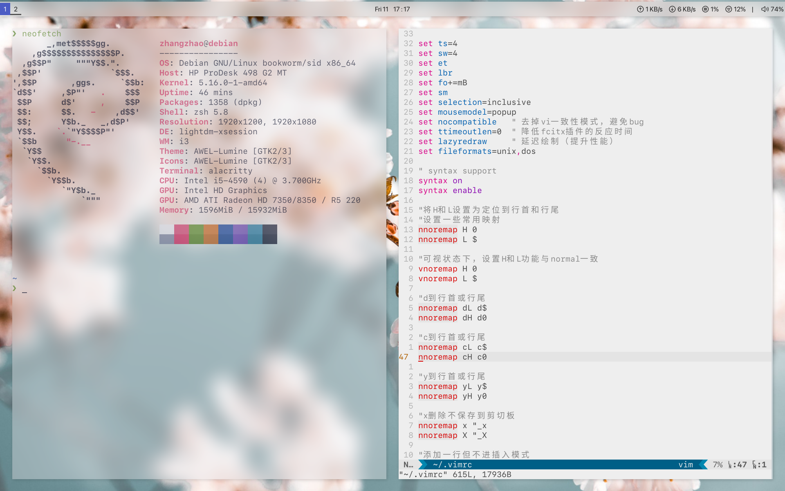

# My dotfiles, managed by GNU Stow, inspired by prettyi3


- vim theme: papercolor
- alacritty theme: iceberg

    

## **Requirments:**

prettyi3(https://github.com/aeghn/prettyi3)

#### **package(apt&&cargo&&pip):**
- [requirements(apt)](requirements.apt)
- [requirements(cargo)](requirements.cargo)
- [requirements(pip)](requirements.pip)

#### **other software(manually):**
```bash
oh-my-zsh vim sogoupinyin i3lock-color betterlockscreen v2raya(docker) docker code wemeet
```

#### **My fonts:**
- fonts-noto-cjk for Chinese
- sf mono for code
- sf pro display for polybar

#### **cursor theme:**
- breeze-cursor-theme for cursor

## **Installation**
install stow first.
there are four scripts can be used:

- stow_all:  stow all dotfiles, include home/ and /etc/.
- unstow_all:  unstow all dotfiles, include home/ and /etc/.
- stow:  stow one app at a time.
- unstow:  unstow one app at a time.

---------------------------------------------------------------

## **docker records:**
~~### 1. glances~~

```bash
sudo docker run -d \
         --restart=always \
         -p 61208-61209:61208-61209 \
         -e GLANCES_OPT="-w" \
         -v /home/zhangzhao/.config/glances/glances.conf:/glances/conf/glances.conf \
         -v /var/run/docker.sock:/var/run/docker.sock:ro \
         --pid host \
         --name debian \
         nicolargo/glances:latest
```

### 2. v2raya

```bash
sudo docker run -d \
        --restart=always \
        --privileged \
        --network=host \
        --name v2raya \
        -v /lib/modules:/lib/modules \
        -v /etc/resolv.conf:/etc/resolv.conf \
        -v /etc/v2raya:/etc/v2raya \
        mzz2017/v2raya
```

~~### 3. lkmpg~~

```bash
sudo docker run --rm \
        -it \
        -v /home/zhangzhao/Code/lkmpg:/workdir \
        twtug/lkmpg
```

---------------------------------------------------------------

## **Bug records**

### 1. plymouth failed when update initramfs

> E: plymouth failed with return 1

```bash
# plymouth depends on dejavu font.
# stow dejavu font for plymouth:
cd ~/dotfiles
stow dejavu
```

### 2. webdav: systemd server failed

```bash
# add webdav address, username and passwd to davfs2:
sudo echo "use_locks 0"  >> /etc/davfs2/davfs2.conf
sudo echo "address username passwd" >>/etc/davfs2/secrets
sudo chmod 0600 /etc/davfs2/secrets
```

